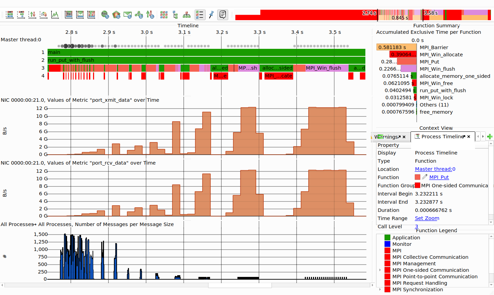

# Score-P Infiniband Plugin
This repo provides an async Score-P plugin for infiniband counters via sysfs.

Currently a [feature branch of Score-P](https://perftools.pages.jsc.fz-juelich.de/cicd/scorep/branches/MR650/latest.tar.gz)
is needed which provides the new `hwloc` based topology detection for metric sources.

It provides access to counter metrics in `/sys/class/infiniband/mlx5_*/ports/*/{hw_,}counters/*`.
## Usage
Install this plugin into a location detectable by Score-P (e.g.`<scorep-install>/lib`) or `LD_LIBRARY_PATH`.

Set environment variables to use the plugin.
```
export SCOREP_METRIC_PLUGINS=infiniband_plugin      # required
export SCOREP_METRIC_INFINIBAND_PLUGIN='*'          # required
export SCOREP_METRIC_INFINIBAND_PLUGIN_INTERVAL=20  # (optional) Sampling interval in ms
export INFINIBAND_PLUGIN_VERBOSE=WARN # FATAL, ERROR, WARN, INFO, DEBUG

export SCOREP_ENABLE_PROFILING=0 # Required
export SCOREP_ENABLE_TRACING=1
export SCOREP_TOTAL_MEMORY=1G
```

To only sample certain counters specify them in `SCOREP_METRIC_INFINIBAND_PLUGIN`, e.g.
```
export SCOREP_METRIC_INFINIBAND_PLUGIN='rx_atomic_requests,port_xmit_data'
```

## Example
Example for the `./osu_put_bw` OSU MPI Benchmark.


## Counter Explanation

`https://enterprise-support.nvidia.com/s/article/understanding-mlx5-linux-counters-and-status-parameters`